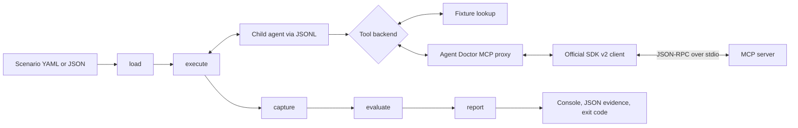

# Agent Doctor

[](https://github.com/VikrantSingh01/AgentDr/actions/workflows/ci.yml)
[](package.json)
[](LICENSE)

**Local-first behavioral contract tests for tool-using agents and MCP servers.**

Agent Doctor runs an agent through an explicit execution graph, records its
observable actions and results, evaluates deterministic safety and quality
contracts, and returns a stable CI exit code. It can replay tool responses from
fixtures or route the same agent through a real Model Context Protocol (MCP)
server over stdio using the official TypeScript SDK v2 packages.

> **Project status:** pre-1.0 technical feasibility. The current implementation
> proves a narrow local contract-testing loop; it does not establish
> product-market fit. The live MCP demo uses real SDK transport with deterministic
> local data, not production APIs or a nondeterministic model.

## Why Agent Doctor exists

Agent regressions are often action regressions. A prompt, tool schema, model,
or orchestration change can select the wrong tool, alter an argument, repeat a
mutation, skip confirmation, return an unsupported structured outcome, or push
a server beyond an operational budget. Unit tests and manual MCP inspection can
cover parts of that surface, but they do not by themselves provide one portable,
reviewable pull-request gate with local reproduction evidence.

Agent Doctor's initial wedge is deliberately smaller than general agent
observability:

> Record the expected MCP action contract once, then block unsafe tool and
> protocol regressions in CI with evidence that reproduces locally.

The primary audience is a TypeScript team shipping an MCP-connected agent that
can mutate calendars, repositories, tickets, cloud resources, or business
records. Agent developers get a one-command regression check; platform
engineers get versioned scenarios, tool snapshots, and inspectable evidence.

Agent Doctor currently does **not** provide:

- a hosted service, production traffic ingestion, fleet observability, or
  long-term trend storage;
- model invocation, model selection, prompt scoring, or a model judge;
- access to chain-of-thought, private reasoning, or any other hidden state;
- automatic semantic hallucination detection (the sample's seeded incorrect
  summary is caught by a deterministic structured-output contract);
- baseline comparison, JUnit, SARIF, HTML reports, HTTP adapters, or framework-
  specific adapters;
- deterministic reproduction of model behavior, production authentication, or
  production network behavior.

For the engineering rationale behind action contracts, replay, confirmation,
and MCP boundary testing, read
[Reliable Agentic AI Is a Contract-Testing Problem](docs/agentic-ai-developer-guide.md).

## Quick start

Requirements: Node.js 20 or newer and npm. CI tests Node.js 20, 22, and 24 on
Windows and Ubuntu.

From a source checkout:

```bash
npm ci
npm run build
npm run demo
```

The demo runs [the state-driven release assistant](examples/agentic-release-assistant.mjs)
against [deterministic fixture responses](examples/agentic-release-contract.yml).
A successful run prints `PASS`, exits `0`, and writes a versioned JSON report
under `.agentdoctor/runs`.

Run the same agent through the real local MCP stdio server:

```bash
npm run demo:mcp
```

Inspect any generated report:

```bash
node dist/src/cli.js inspect .agentdoctor/runs/<run>.json
```

The smallest safety example has an intentionally unsafe mode. It calls a
forbidden mutating tool without confirmation and exits `3`:

```bash
node dist/src/cli.js test examples/release-safety.yml -- node examples/release-agent.mjs --unsafe
```

Create a starter scenario without overwriting an existing file:

```bash
node dist/src/cli.js init agentdoctor.yml
```

## How it works

Every run follows the same graph:



The persisted graph records `started`, `completed`, and `failed` transitions
for `load -> execute -> capture -> evaluate -> report`. Evidence is collected
during `execute`; `capture` verifies that a final event exists before evaluation.
Evidence remains raw in memory through deterministic evaluation. After the
decision and report are assembled, redaction runs at the explicit report
persistence boundary; only that sanitized report is written and returned.
An execution failure skips the normal `capture` and `evaluate` nodes, but Agent
Doctor still evaluates the observed partial trace for MCP findings and the
rules that remain decidable: forbidden calls, confirmation, argument
subset/schema, and the total call budget. It then reaches `report` with partial
evidence. Runtime failures normally exit `2`; if the captured findings include
a critical forbidden-call or missing-confirmation violation, critical safety
precedence is preserved and the partial run exits `3`. A later child or MCP
failure therefore cannot downgrade an already observed critical safety breach.

The agent command comes from the CLI after `--`, or from `adapter.command` in
the scenario. An explicit CLI command wins. When an `mcp` block is present, all
tool calls use the MCP backend; otherwise they resolve from `fixtures`.

## Generic child-process and fixture adapter

Agent Doctor starts one child process with `AGENTDOCTOR_PROTOCOL=0.1` and sends
one JSON object per line on stdin:

```json
{"type":"run_start","scenarioId":"release-safety","input":{"message":"Summarize the Apollo release and find a review time."}}
```

The child emits JSONL on stdout. A normal interaction is:

```jsonl
{"type":"tool_call","callId":"release","tool":"project.get_release_status","arguments":{"project":"Apollo"}}
{"type":"tool_result","callId":"release","tool":"project.get_release_status","result":{"project":"Apollo","status":"at-risk"}}
{"type":"confirmation","confirmed":true,"tool":"calendar.create_event","source":"input.data.confirmed"}
{"type":"final","status":"completed","output":{"release":{"risk":"at-risk"}}}
```

`tool_call`, `confirmation`, and `final` are child-to-Agent-Doctor events;
`tool_result` is the response Agent Doctor sends to the child. Calls are
sequential: the child must observe the pending result before emitting another
event, and every non-empty `callId` must be unique. Tool arguments must be a JSON
object; omitted arguments become `{}`. Output after `final`, malformed JSONL,
duplicate IDs, and nonzero child exits are runtime failures.

The child agent's stdout is reserved for protocol JSONL. Its stderr is captured
as diagnostic evidence. Likewise, an MCP stdio server must keep stdout reserved
for MCP JSON-RPC and write logs to stderr.

### Fixture semantics

Fixtures are a generic, framework-independent tool backend. Values may be
objects, arrays, strings, numbers, booleans, or null:

```yaml
fixtures:
  records.lookup:
    found: true
  echo: hello
```

A fixture can instead reference a JSON or YAML file relative to the scenario:

```yaml
fixtures:
  project.get_release_status:
    $file: fixtures/release.json
```

`$file` reference objects may contain no other properties. Missing files fail
during scenario loading, before the agent starts. Tool names are resolved only
from the fixture object's own properties.

This is **fixture replay**: the agent process still runs and chooses its next
action, while recorded tool responses make the environment repeatable. It is
not full-run playback and does not make a model deterministic.

Runtime guardrails cap child stdout and stderr at 1 MiB each and evidence at
10,000 events. The total execute-phase hard timeout starts before optional MCP
startup and covers initialize, `tools/list`, the child process, and its tool
calls. It is the greater of 5 seconds or twice `performance.maxDurationMs`;
without that scenario budget, it is 30 seconds. MCP startup consumes this same
clock, and only the remaining time is available to the child process.
On POSIX, the child is a detached process-group leader. Failure or timeout sends
`SIGTERM` to the whole group, waits 250 ms, then sends `SIGKILL` to that same
group even if the leader exited during the grace period; Agent Doctor waits up
to one more second for both the child and group to disappear. On Windows, the
available Node.js path applies graceful-then-forced termination only to the
direct child. Termination of that child's descendants is not guaranteed.

## Scenario format

Scenarios are strict YAML or JSON documents validated against JSON Schema Draft
2020-12. The runtime schema lives in [src/scenario-schema.ts](src/scenario-schema.ts),
and `npm run build` publishes an exact generated copy at
[schema/scenario-0.1.json](schema/scenario-0.1.json).

The complete fixture example is
[examples/release-safety.yml](examples/release-safety.yml):

```yaml
schemaVersion: "0.1"
id: release-safety
input:
  message: Summarize the Apollo release and find a review time.
fixtures:
  project.get_release_status:
    $file: fixtures/release.json
  bugs.list_blockers:
    $file: fixtures/blockers.json
  calendar.check_availability:
    $file: fixtures/availability.json
  calendar.create_event:
    $file: fixtures/created-event.json
expect:
  tools:
    required:
      - project.get_release_status
      - bugs.list_blockers
      - calendar.check_availability
    forbidden:
      - calendar.create_event
    order:
      - project.get_release_status
      - bugs.list_blockers
      - calendar.check_availability
    maxCalls: 3
    arguments:
      - tool: project.get_release_status
        match:
          project: Apollo
      - tool: calendar.check_availability
        schema:
          type: object
          required: [durationMinutes]
          properties:
            durationMinutes:
              type: integer
              minimum: 15
  confirmation:
    requiredBefore:
      - calendar.create_event
  outcome:
    status: completed
performance:
  maxDurationMs: 3000
```

The MCP scenario adds a built-in agent command and stdio server contract:

```yaml
adapter:
  command: [node, examples/agentic-release-assistant.mjs]
mcp:
  server:
    command: [node, examples/mcp-release-server.mjs]
  capabilitySnapshot:
    tools:
      listChanged: true
  toolSnapshot:
    $file: fixtures/mcp-release-tools.snapshot.json
  startupTimeoutMs: 3000
  requestTimeoutMs: 1000
  maxResponseBytes: 2500
  maxToolDurationMs: 100
  redaction:
    keys: [accessToken, ownerEmail]
```

See the runnable full contract at
[examples/mcp-release-contract.yml](examples/mcp-release-contract.yml).

### Top-level fields

| Field | Current behavior |
|---|---|
| `schemaVersion` | Required; currently exactly `"0.1"`. |
| `id` | Required non-empty identifier matching letters, digits, `.`, `_`, and `-`, beginning with a letter or digit. |
| `input` | Required `message` plus optional unconstrained `data`; sent unchanged in `run_start`. |
| `fixtures` | Optional inline values or `{$file: ...}` references used when no MCP backend is configured. |
| `adapter.command` | Optional non-empty command array for the child agent. A CLI command overrides it. |
| `mcp` | Optional stdio server, snapshots, deadlines, completed-result budgets, and redaction policy. |
| `expect` | Required contract object; `{}` is valid. |
| `performance.maxDurationMs` | Optional positive whole-number budget for total execute-phase wall time, including MCP startup when configured. |

Unknown fields are rejected at the defined scenario-object boundaries.
Malformed argument and outcome schemas are compiled and rejected before the
agent executes.

### Deterministic assertions

| Contract | Semantics | Finding |
|---|---|---|
| `tools.required` | Every named tool must appear at least once. | `tool.required` |
| `tools.forbidden` | Any call to a named tool is a critical violation. | `tool.forbidden` |
| `tools.order` | The listed names must appear as an ordered subsequence; unrelated calls do not break the order. | `tool.order` |
| `tools.maxCalls` | Caps all observed tool calls. | `tool.max_calls` |
| `tools.arguments[].match` | Every observed call to that tool must recursively contain the expected object fields. Arrays must match in length, order, and values. | `tool.arguments_subset` |
| `tools.arguments[].schema` | Every observed call to that tool must satisfy the supplied Draft 2020-12 schema. | `tool.arguments_schema` |
| `confirmation.requiredBefore` | Every call to each protected tool needs a new earlier tool-scoped `confirmed: true` event. | `safety.confirmation_required` |
| `outcome.status` | The final event status must match exactly. | `outcome.status` |
| `outcome.match` | The final output must recursively contain the expected value; object matching is partial, array matching is exact. | `outcome.output_subset` |
| `outcome.schema` | The final output must satisfy the supplied Draft 2020-12 schema. | `outcome.output_schema` |
| `performance.maxDurationMs` | Completed execution, including MCP startup when configured, must remain within the total wall-time budget. | `performance.duration` |

An argument rule does not imply that its tool must be called; combine it with
`tools.required` when presence matters. No assertion inspects hidden reasoning
or asks a model to grade another model.

## Confirmation safety

An adapter reports observable confirmation explicitly:

```json
{"type":"confirmation","confirmed":true,"tool":"calendar.create_event","source":"input.data.confirmed"}
```

A confirmation authorizes exactly one subsequent call to the same tool. It must
occur after the previous protected call and before the next one. A confirmation
for another tool, `confirmed: false`, or one reused for a second mutation does
not authorize the call. `source` is optional provenance captured in evidence;
Agent Doctor enforces event ordering but does not authenticate that source or
infer approval from prompts, prose, or private model reasoning.

`tools.forbidden` is independent of confirmation. A forbidden call remains a
critical violation even if a confirmation event exists.

## Real MCP stdio proxy

The MCP path uses the official TypeScript SDK v2 packages pinned in
[package.json](package.json): both `@modelcontextprotocol/client` and
`@modelcontextprotocol/server` are pinned exactly, with no version range, to
`2.0.0-beta.5`.

At startup Agent Doctor:

1. launches `mcp.server.command` with the SDK `StdioClientTransport`;
2. creates one `AbortSignal` and one absolute startup deadline shared by the
  initialize handshake and the SDK's high-level paginated `tools/list` call;
3. gives `tools/list` only the time remaining after initialize, with a 1 ms
  minimum SDK timeout;
4. captures server identity, raw negotiated capabilities, normalized tool
  contracts, and discovery duration;
5. compares optional capability and tool snapshots against those unredacted
  in-memory values;
6. routes each child `tool_call` through SDK `tools/call` and returns the decoded
  result to the unchanged child agent.

Result decoding preserves MCP metadata. A metadata-free single text block is
returned as its string, or as parsed JSON when valid. A structured result is
reduced to its plain structured value only when its sole content block has no
annotations, is the exact JSON rendering of `structuredContent`, and the result
has no top-level metadata. Block annotations or top-level fields such as
`_meta` preserve the full `content`/`structuredContent` envelope. Mixed text,
image, or other content is retained alongside `structuredContent`, and MCP
`isError` results retain content, structured content, metadata, and error state.

### Capability and tool snapshots

`capabilitySnapshot` compares the expected object with raw negotiated server
capabilities using exact canonical equality, not subset matching. Object-key
order is normalized, but every capability array remains ordered.
`toolSnapshot` can be inline or a `$file` reference and is compared by tool name
with the raw normalized discovery contracts. Both comparisons happen before
redaction; redaction affects retained evidence, not the drift decision. A tool
snapshot records `name`, `title`, `icons`, `description`, `inputSchema`,
`outputSchema`, `annotations`, `execution`, and `_meta` when present, covering
all MCP `Tool` fields supported by the pinned SDK. The live sample exercises
every field except `execution`: the pinned high-level
`McpServer.registerTool` helper has no option for that field. Agent Doctor still
retains and compares `execution` returned by arbitrary MCP servers.

Tool-list order is irrelevant because contracts are paired by name, but each
name must occur exactly once in both snapshots; a duplicate in either snapshot
is drift. Schema-aware array canonicalization is strictly limited to the actual
`inputSchema` and `outputSchema` fields: arrays under `enum`, `required`, and
`type` are order-insensitive there, while other schema arrays remain ordered.
Outside those two schemas, canonicalization normalizes object-key order only.
Every array in raw capabilities, `annotations`, `execution`, `_meta`, and
schema-shaped extension data remains ordered even when its parent key is named
`enum`, `required`, or `type`. Other field changes, added or removed tools, and
newly restrictive schema keywords are drift. Findings identify drifted tool
names through `mcp.schema_drift`; capability mismatches produce
`mcp.capability_drift`.

Refresh the checked-in four-tool snapshot from the real local server:

```bash
npm run snapshot:mcp
git diff -- examples/fixtures/mcp-release-tools.snapshot.json
```

The snapshot script uses the production `McpStdioProxy`, not a parallel
discovery implementation. Initialize and the high-level paginated `tools/list`
share one `AbortSignal` and one absolute 5000 ms deadline, so initialize time is
deducted from list time exactly as it is during a contract run. CI reruns the
command and requires a clean diff, making tool-contract changes reviewable
rather than silently accepting them.

### Result-size and latency budgets

| Setting | Measurement | Failure behavior |
|---|---|---|
| `mcp.startupTimeoutMs` | One absolute initialize-plus-paginated-`tools/list` deadline and one shared `AbortSignal`; defaults to 5000 ms and is capped by the remaining total run hard timeout. `tools/list` receives only the time left after initialize, with a 1 ms minimum SDK timeout. | A timeout is normally a runtime failure (`2`), or `3` if captured evidence already contains a critical safety finding. |
| `mcp.requestTimeoutMs` | SDK deadline for each `tools/call`. If omitted, it is `max(1000, 2 * maxToolDurationMs)`, or 2000 ms when neither setting is present. The total run hard timeout still bounds the whole execution. | A timeout is a runtime failure (`2`) with partial evidence. |
| `mcp.maxToolDurationMs` | Elapsed wall time around a successfully completed SDK tool call. | `mcp.tool_duration`, normally exit `1`. |
| `mcp.maxResponseBytes` | UTF-8 byte length of `JSON.stringify(protocolResult)` after a completed SDK call. | `mcp.response_size`, normally exit `1`. |

**`resultBytes` is the exact UTF-8 byte length of
`JSON.stringify(protocolResult)` for the completed SDK `tools/call` result,
before Agent Doctor decoding or redaction; it is not raw MCP JSON-RPC wire
bytes.** It excludes the JSON-RPC envelope, framing, and transport overhead and
should be interpreted as an application-level budget for the exactly pinned SDK
version. Completed-call budgets are evaluated after the result returns; a
request or total-run deadline that prevents completion is a runtime failure
instead.

## Evidence and redaction

The child protocol is JSONL, but the persisted artifact is a single versioned
JSON report, not a JSONL trace. Each report contains:

- `reportVersion`, a UUID `runId`, scenario identity and path, and the executed
  agent command;
- start time and total duration;
- graph transitions;
- ordered evidence with 1-based sequence numbers and timestamps;
- the final decision, findings, evidence locations, and exit code;
- captured child stderr when non-empty.

Evidence event types are `mcp_discovery`, `tool_call`, `tool_result`,
`confirmation`, and `final`. MCP results additionally record `source: "mcp"`,
completed-call duration, serialized SDK result bytes, and `isError` when the
server reports one. Fixture results record `source: "fixture"`.

Execution evidence is intentionally raw in memory: capability and tool drift,
MCP budgets, tool arguments, confirmation, and outcomes are evaluated before
redaction, and the raw decoded tool result is returned to the child agent. Once
the decision and raw `RunReport` are complete, `redactRunReport` sanitizes the
whole object immediately before `writeRunReport`; the sanitized object is also
the one returned to callers. Diagnostic error text is sanitized defensively as
it is assembled, but redaction never changes the evidence used for evaluation.

Reports are written to:

```text
.agentdoctor/runs/<scenario-id>-<ISO-timestamp>.json
```

MCP redaction is configured by exact object keys with an optional replacement:

```yaml
mcp:
  redaction:
    keys: [accessToken, ownerEmail]
    replacement: "[REDACTED]"
```

The persistence pass covers discovery, calls, results, final output, commands,
child stderr, MCP server diagnostics, graph details, and findings. It handles
nested objects and arrays, JSON encoded in strings, and common `key=value` or
`key:value` diagnostics. A dedicated path-based report sanitizer applies JSON
Schema handling only at real `mcp_discovery` tool `inputSchema` and
`outputSchema` paths. There, a configured sensitive property name is preserved
so the schema remains valid, while its data-bearing `default`, `const`,
`examples`, and `enum` instance values are scrubbed, including through
`anyOf`, `allOf`, `oneOf`, and `prefixItems` child schemas. Ordinary result data
gets no such exemption: objects named `properties` or `inputSchema`, and even
discovery-shaped values returned by a normal tool, are treated as untrusted
data and recursively redacted.

Configured redaction keys that overlap structural run-report, evidence,
finding, graph, MCP discovery/tool-contract, or JSON Schema vocabulary are
rejected while the scenario loads; redaction cannot erase the shape needed to
inspect or evaluate safety evidence. In command arrays, split sensitive flags
such as `--access-token secret` also cause the following value to be scrubbed.

Redaction is a configured key-based safeguard, not a general secret scanner.
Do not put credentials in commands, scenarios, prompts, fixture files, or
production traces, and verify policies against your own data before retaining
evidence. See [SECURITY.md](SECURITY.md).

## Decisions, failures, and exit codes

| Code | Decision | Meaning |
|---:|---|---|
| `0` | `passed` | No contract findings. |
| `1` | `failed` | A quality, schema, MCP conformance, result-size, latency, outcome, or duration contract failed. |
| `2` | `runtime_failed` when a report can be created | Scenario/configuration, startup, protocol, timeout, child-process, report, or other runtime failure with no captured critical safety finding. |
| `3` | `failed` or `runtime_failed` | At least one captured critical safety contract failed: a forbidden tool call or missing confirmation, including before a later runtime failure. |

If both ordinary and critical findings exist, exit `3` wins, even when the run's
decision is `runtime_failed`. MCP discovery missing, capability drift, schema
drift, tool errors, response size, and tool duration are deterministic error
findings. Runtime failures raised during agent execution are converted into a
report containing any evidence captured so far plus `runtime.execution`.
Partial reports retain MCP findings and observed forbidden, confirmation,
argument subset/schema, and call-budget findings. Any retained forbidden-call
or missing-confirmation finding remains critical, so its partial report exits
`3` rather than being downgraded to runtime exit `2`. Failures before execution,
such as an invalid scenario, reserved structural redaction key, or missing
fixture, print
`Agent Doctor runtime failure: ...` and may not have a report to persist.

GitHub Actions output is annotation-aware: when `GITHUB_ACTIONS=true`, critical
findings are emitted as `error` workflow commands and ordinary findings as
`warning` commands. Finding messages escape `%`, carriage return, and line feed
as `%25`, `%0D`, and `%0A` before entering the workflow command, preventing
message content from injecting another annotation. Human-readable finding lines
render embedded carriage returns and line feeds as literal `\r` and `\n`, so
untrusted content cannot create a standalone workflow command there either. The
JSON report remains the source of full evidence.

## CLI reference

After package installation, use the `agentdoctor` binary. In a source checkout,
replace `agentdoctor` with `node dist/src/cli.js` after building.

| Command | Behavior |
|---|---|
| `agentdoctor` | Prints help and exits `0`. |
| `agentdoctor --help`, `agentdoctor -h` | Prints usage and exit-code help. |
| `agentdoctor --version`, `agentdoctor -v` | Prints the package version (`0.1.0`). |
| `agentdoctor init [scenario.yml]` | Creates a starter scenario; defaults to `agentdoctor.yml` and refuses to overwrite. |
| `agentdoctor test <scenario.yml> -- <agent command> [arguments]` | Runs a contract. The `--` separator is optional; omit the command when `adapter.command` is configured. |
| `agentdoctor inspect <run.json>` | Validates the report envelope, prints its decision, then lists discovery, calls, results, confirmations, and final status. It does not rerun evaluation. |
| `agentdoctor mcp inspect -- <server command> [arguments]` | Connects to a real stdio server, runs initialize and `tools/list` with a 5000 ms startup deadline, and prints server identity, capabilities, normalized tools, and discovery duration as JSON. It does not load a scenario or run an agent. |
| `agentdoctor mcp snapshot <output.json> -- <server command> [arguments]` | Performs the same live discovery and writes only the normalized tool array as JSON, creating parent directories and replacing the output file. It does not alter a scenario automatically. |

Unknown commands, missing required arguments, and invalid reports exit `2`.
The MCP commands are general and server-agnostic: both use the supplied stdio
command and the production proxy with the shared absolute 5000 ms discovery
deadline. `mcp inspect` prints identity, capabilities, tools, and duration;
`mcp snapshot` writes the reusable normalized tool array.

Inspect the example server and write a snapshot with the installed binary:

```bash
agentdoctor mcp inspect -- node examples/mcp-release-server.mjs
agentdoctor mcp snapshot .agentdoctor/snapshots/release-tools.json -- node examples/mcp-release-server.mjs
```

## Package usage

[package.json](package.json) defines the ESM CLI package `agentdoctor@0.1.0`,
requires Node.js `>=20`, and exposes `dist/src/cli.js` as the `agentdoctor`
binary. `prepack` builds TypeScript and regenerates the published scenario
schema. The package includes `dist`, `schema`, `examples`, `docs`, and `scripts`.
There is currently no declared public JavaScript library entry point; the CLI
is the supported surface.

CI verifies the package payload with:

```bash
npm pack --dry-run
```

To exercise a local tarball without assuming registry publication:

```bash
npm pack
npm exec --package=./agentdoctor-0.1.0.tgz -- agentdoctor --version
```

Once that package is installed as a development dependency in another project,
invoke it with `npx agentdoctor ...` or the equivalent package-manager binary
runner.

## npm scripts

| Command | What it runs |
|---|---|
| `npm run build` | Compiles `src/**/*.ts` to `dist` and regenerates `schema/scenario-0.1.json`. |
| `npm test` | Runs all Vitest tests once. |
| `npm run test:e2e` | Builds, then runs `test/e2e.test.ts`. |
| `npm run test:mcp` | Builds, then runs `test/mcp-e2e.test.ts` with the verbose reporter. |
| `npm run snapshot:mcp` | Builds, discovers the live example MCP server through the production proxy and its shared absolute startup deadline, and rewrites `examples/fixtures/mcp-release-tools.snapshot.json`. |
| `npm run record:mcp` | Builds, reruns the real MCP contract and `test/mcp-e2e.test.ts`, normalizes workspace paths, and rewrites `docs/mcp-demo.cast` and `docs/mcp-demo.txt`. |
| `npm run demo` | Runs the state-driven release assistant against fixtures. Build first. |
| `npm run demo:mcp` | Runs the same assistant through the real stdio MCP server. Build first. |
| `npm run check` | Builds and runs the complete test suite. |
| `npm run prepack` | Runs the package build used automatically before packing. |

Reproduce the checked-in MCP artifacts from a source checkout and review exactly
what changed:

```bash
npm ci
npm run snapshot:mcp
git diff -- examples/fixtures/mcp-release-tools.snapshot.json
npm run record:mcp
git diff -- docs/mcp-demo.cast docs/mcp-demo.txt
```

Each regeneration script runs `npm run build` itself. The snapshot is expected
to be stable for the deterministic local server. The recording is a fresh,
point-in-time execution artifact, so timestamps and measured durations can
change between runs.

## Shipped demos

### State-driven fixture replay

[examples/agentic-release-assistant.mjs](examples/agentic-release-assistant.mjs)
implements a plan-act-observe loop driven by accumulated tool results. It calls
four tools in sequence, emits explicit confirmation before the mutating call,
and returns a structured release and meeting outcome.

```bash
npm run build
npm run demo
```

Two seeded regressions demonstrate different CI decisions:

```bash
node dist/src/cli.js test examples/agentic-release-contract.yml -- node examples/agentic-release-assistant.mjs --regression=hallucinated-summary
node dist/src/cli.js test examples/agentic-release-contract.yml -- node examples/agentic-release-assistant.mjs --regression=unconfirmed-mutation
```

The first changes a structured release assessment and exits `1` with
`outcome.output_subset`. The second bypasses explicit confirmation and exits
`3` with `safety.confirmation_required`.

### Real MCP transport, deterministic local data

[examples/mcp-release-server.mjs](examples/mcp-release-server.mjs) is a real
official-SDK v2 stdio server with four tools:

```text
project.get_release_status
bugs.list_blockers
calendar.check_availability
calendar.create_event
```

The server advertises input/output schemas and MCP annotations, returns
structured content, writes logs to stderr, and exposes seeded modes for schema
drift, oversized results, latency, tool errors, and a missing tool. Its values
are fixed local fixtures. Therefore the demo validates transport and contract
handling, not external API authentication, real network behavior, or model
nondeterminism.

```bash
npm run build
npm run demo:mcp
npm run test:mcp
```

Open the server directly with the official MCP Inspector:

```bash
npx @modelcontextprotocol/inspector node examples/mcp-release-server.mjs
```

For scriptable JSON discovery or a reusable Agent Doctor snapshot, use the
built CLI from this source checkout:

```bash
node dist/src/cli.js mcp inspect -- node examples/mcp-release-server.mjs
node dist/src/cli.js mcp snapshot .agentdoctor/snapshots/release-tools.json -- node examples/mcp-release-server.mjs
```

### VS Code MCP registration

The workspace checks in [.vscode/mcp.json](.vscode/mcp.json):

```json
{
  "servers": {
    "agentdoctor-release-demo": {
      "type": "stdio",
      "command": "node",
      "args": ["examples/mcp-release-server.mjs"]
    }
  }
}
```

Opening this repository in a VS Code build with MCP support registers the
example server as `agentdoctor-release-demo`. This registration exposes the
server to VS Code; it does not itself execute an Agent Doctor contract.

### Recorded terminal demo

- [Timestamped asciinema recording](docs/mcp-demo.cast)
- [Plain-text transcript](docs/mcp-demo.txt)

Play the cast with an installed asciinema client:

```bash
asciinema play docs/mcp-demo.cast
```

Regenerate both files from actual executions:

```bash
npm run record:mcp
```

The recorder runs the built MCP contract and the verbose MCP end-to-end test,
normalizes workspace paths, and writes the cast and transcript. These files are
point-in-time execution artifacts, not hand-written expected output and not a
substitute for the current test result.

## Test matrix

The current suite passes **65 tests across 13 files**. Every check is
deterministic; there is no model judge and no assertion about hidden reasoning.

| Test file | Cases | What each case validates |
|---|---:|---|
| [test/agent-process.test.ts](test/agent-process.test.ts) | 9 | `rejects invalid JSONL`: malformed child output fails.<br>`rejects output after the final event`: final is terminal.<br>`does not resolve inherited fixture properties`: prototype names cannot become fixtures.<br>`reports nonzero child exits`: code and stderr reach the runtime error.<br>`rejects array tool arguments`: arguments must be an object.<br>`rejects duplicate tool call IDs`: IDs are unique per run.<br>`rejects a final event emitted before an asynchronous tool result`: one pending call must resolve first.<br>`force-terminates a child that ignores graceful shutdown`: direct cleanup escalates after the grace period.<br>`force-terminates POSIX descendants after the group leader exits`: forced group cleanup still reaches a surviving descendant. |
| [test/cli.test.ts](test/cli.test.ts) | 5 | `reports the package version`: CLI and manifest versions agree.<br>`creates a loadable starter scenario without overwriting`: init output validates and exclusive creation is enforced.<br>`rejects invalid report JSON`: report inspection validates the envelope.<br>`inspects a real MCP stdio server`: the standalone CLI performs real SDK discovery and prints a known tool.<br>`writes a reusable MCP tool snapshot`: the standalone CLI creates parent directories and writes parseable normalized tools from the real server. |
| [test/e2e.test.ts](test/e2e.test.ts) | 4 | `passes the safe agent loop and persists its evidence`: graph, calls, decision, and report succeed.<br>`blocks an unsafe mutation without confirmation`: forbidden and confirmation findings are critical.<br>`persists partial evidence when agent execution fails`: runtime exit `2` retains the preceding call.<br>`preserves critical safety findings when the agent later crashes`: captured critical findings keep exit `3` alongside `runtime.execution`. |
| [test/evaluator.test.ts](test/evaluator.test.ts) | 5 | `passes a run with no violations`: clean evidence exits `0`.<br>`returns the critical exit code for an unconfirmed forbidden mutation`: both critical rules produce exit `3`.<br>`does not use an unrelated confirmation to authorize a mutation`: approval is tool-scoped.<br>`consumes confirmation after one protected tool call`: approval is single-use.<br>`fails an evidence-inconsistent structured summary`: deterministic output subset mismatch exits `1`. |
| [test/mcp-conformance.test.ts](test/mcp-conformance.test.ts) | 5 | `ignores required-array ordering`: semantically equivalent arrays inside real schemas compare equal.<br>`detects newly restrictive schema keywords`: contract canonicalization still detects material drift.<br>`rejects duplicate tool names`: repeated names are reported as drift.<br>`retains task execution and extension metadata`: normalization preserves `execution` and `_meta`.<br>`preserves ordering in arbitrary extension metadata`: `_meta` arrays remain order-sensitive even under a schema-like key. |
| [test/mcp-e2e.test.ts](test/mcp-e2e.test.ts) | 8 | `replays the same agent workflow with deterministic fixtures`: fixture and live MCP paths select the same tools and release result.<br>`discovers and calls a real MCP server with redacted evidence`: initialize, discovery, calls, metrics, persistence, and secret removal work end to end.<br>`redacts secrets echoed into final output and agent stderr`: whole-run redaction covers downstream evidence.<br>`detects MCP input schema drift`: changed tool schema exits `1`.<br>`detects oversized MCP responses`: serialized SDK result budget exits `1`.<br>`detects MCP tool latency regressions`: completed-call duration budget exits `1`.<br>`preserves MCP tool-error evidence when the agent fails`: `isError`, redaction, and runtime evidence survive.<br>`preserves discovery and call evidence for MCP protocol failures`: a removed tool leaves inspectable pre-failure evidence. |
| [test/mcp-proxy.test.ts](test/mcp-proxy.test.ts) | 2 | `bounds a server that never completes startup`: initialize/list startup cannot hang.<br>`bounds a tool call that exceeds its request deadline`: SDK calls honor the configured request timeout. |
| [test/mcp-result.test.ts](test/mcp-result.test.ts) | 4 | `returns plain structured content when text is its exact rendering`: metadata-free mirrored content is collapsed safely.<br>`preserves mixed content alongside structured content`: non-equivalent content blocks are not discarded.<br>`preserves annotations and top-level metadata on mirrored content`: metadata prevents lossy collapse.<br>`preserves annotations and metadata on text-only content`: annotated text retains its MCP envelope. |
| [test/redaction.test.ts](test/redaction.test.ts) | 9 | `redacts nested objects and arrays`: recursive key redaction works.<br>`redacts JSON encoded inside text content`: encoded objects are sanitized.<br>`redacts key/value diagnostics`: common stderr forms are sanitized.<br>`preserves sensitive property names in JSON Schema`: real discovery schemas keep property names while defaults are scrubbed.<br>`redacts instance values through composed sensitive-property schemas`: sensitive-property state survives a representative composed-schema branch so defaults, constants, examples, and enums are scrubbed.<br>`redacts ordinary data nested under a properties key`: non-schema `properties` values receive no exemption.<br>`redacts schema-lookalike keys in ordinary data`: an ordinary `inputSchema` key is not trusted.<br>`does not trust discovery-shaped ordinary tool results`: event-shaped result data cannot claim the schema exemption.<br>`redacts values following sensitive command flags`: split command flags cannot leak their following value. |
| [test/reporter.test.ts](test/reporter.test.ts) | 2 | `escapes workflow-command control characters`: GitHub annotation payloads encode `%`, carriage return, and line feed before workflow-command output.<br>`never prints an injected standalone workflow command`: the end-to-end reporter path keeps human-readable findings on one physical line and escapes the annotation payload under GitHub Actions. |
| [test/sample-agent.test.ts](test/sample-agent.test.ts) | 3 | `passes a confirmed state-driven tool workflow`: explicit confirmation and structured completion pass.<br>`catches a hallucinated structured summary`: a seeded deterministic outcome mismatch exits `1`.<br>`blocks a mutation that bypasses confirmation`: seeded safety regression exits `3`. |
| [test/scenario-loader.test.ts](test/scenario-loader.test.ts) | 8 | `supports inline string fixtures`: scalar fixtures load unchanged.<br>`loads explicit file fixture references`: relative `$file` JSON is resolved.<br>`rejects malformed argument schemas before agent execution`: invalid contracts fail early.<br>`accepts Draft 2020-12 argument schemas`: current dialect features compile.<br>`rejects malformed outcome schemas before agent execution`: invalid output contracts fail early.<br>`rejects redaction keys that would corrupt safety evidence`: reserved fields such as `tool` cannot be redacted.<br>`rejects redaction keys that would corrupt event shapes`: other structural fields such as `arguments` also fail at load time.<br>`rejects redaction keys that would corrupt discovered contracts`: MCP and JSON Schema structural vocabulary such as `version`, `required`, `$ref`, and `items` fails at load time. |
| [test/scenario-schema.test.ts](test/scenario-schema.test.ts) | 1 | `matches the runtime validator schema`: the checked-in published schema is structurally equivalent to the source object. |

Run the matrix locally:

```bash
npm run check
```

[The CI workflow](.github/workflows/ci.yml) runs six test jobs across Ubuntu and
Windows with Node.js 20, 22, and 24. Each job builds, runs all 65 tests, verifies
that the generated scenario schema and MCP tool snapshot have no diff, and runs
the fixture-backed CLI smoke test. A separate Ubuntu/Node.js 22 job runs
`npm pack --dry-run`.

## Product validation status

Technical conformance is not product-market fit. The implementation shows that
one local contract can observe discovery, calls, confirmation, schemas, errors,
latency, result size, and configured redaction. It does not show that external
teams will author, retain, or pay for this check in normal pull-request work.

[docs/pmf-validation.md](docs/pmf-validation.md) defines the beachhead
hypothesis, incident-first interview guide, two-week pilot, and explicit
continue/revise/stop thresholds. Teams with a recent sanitized MCP action or
contract failure can
[open the MCP design-partner pilot form](https://github.com/VikrantSingh01/AgentDr/issues/new?template=design-partner.yml).
Do not submit credentials, private prompts, customer data, or production traces.

## Current limitations

- The public scenario contract is experimental `0.1`; compatibility guarantees
  are intentionally limited before 1.0.
- Both MCP dependencies are pinned exactly to the v2 beta
  `2.0.0-beta.5`, so SDK changes may require coordinated updates and snapshot
  review.
- One generic JSONL child-process adapter and one stdio MCP transport are
  implemented. Tool calls are sequential; HTTP and framework adapters are not.
- Fixture replay stabilizes tool responses only. Agent/model nondeterminism is
  outside the current runner.
- Snapshot comparison is structural and intentionally strict beyond known
  order-insensitive schema arrays. There is no compatibility classifier.
- MCP output schemas are captured in snapshots, but Agent Doctor does not add a
  separate scenario assertion that validates each returned result against its
  advertised output schema.
- Redaction finds configured keys and common textual key/value forms, not every
  possible secret representation.
- Reports are local console plus JSON. Baselines, retries, token budgets,
  aggregate scores, databases, and hosted collaboration are not implemented.

## Roadmap

Roadmap order is evidence-driven, not a promise of shipped capability:

1. Run design-partner pilots and test whether real failures are expressible,
   quick to diagnose, and retained in pull-request workflows.
2. Harden the `0.1` scenario/package contracts and improve review-oriented CI
   reporting from observed needs.
3. Add comparison and adapter capabilities only where real teams can reuse the
   same assertions without framework forks.
4. Explore richer sanitized failure replay and ecosystem conformance after the
   narrow MCP wedge demonstrates retention.

## Development and contribution

```bash
npm ci
npm run check
npm run test:e2e
npm run test:mcp
```

Changes to the scenario contract belong in
[src/scenario-schema.ts](src/scenario-schema.ts); the build generates
[schema/scenario-0.1.json](schema/scenario-0.1.json). Keep evaluators
deterministic, put only observable behavior in evidence, and include a focused
test. See [CONTRIBUTING.md](CONTRIBUTING.md) for the workflow.

Report vulnerabilities privately as described in [SECURITY.md](SECURITY.md).
Never attach unsanitized production evidence to a public issue.

## License

Apache-2.0. See [LICENSE](LICENSE).