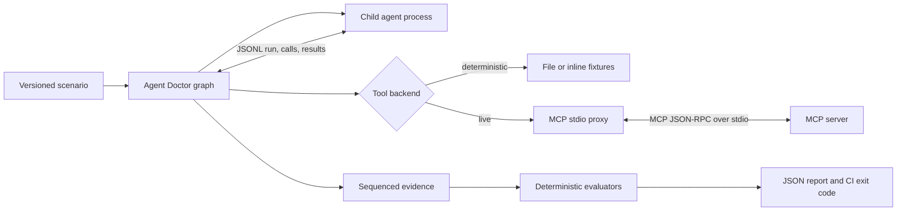

# Reliable Agentic AI Is a Contract-Testing Problem

*A practical guide to testing tool-using agents through observable action contracts, deterministic replay, and real Model Context Protocol stdio boundaries.*

Tool-using AI changes the unit of failure. A conventional application returns a value; an agent may choose a tool, construct arguments, wait for a result, revise its plan, call a mutating tool, and then summarize what happened. The final sentence is only the last artifact in a much larger execution.

That distinction matters in CI. A fluent answer can conceal a wrong tool, unsafe arguments, a skipped confirmation, a protocol incompatibility, or a result payload large enough to destabilize the next model call. Conversely, an exact-text snapshot can fail because harmless wording changed while every meaningful action remained correct.

[Agent Doctor](https://github.com/VikrantSingh01/AgentDr) is a small, local-first reference implementation of a different approach: describe expected actions and outcomes as a versioned contract, run the agent, record observable evidence, and turn violations into stable process exit codes. Its current repository is deliberately narrow, but that narrowness makes the engineering lessons concrete.

## Why Prompt and Output Snapshots Are Not Enough

Prompt snapshots are useful change records. Output snapshots can catch accidental formatting changes. Neither proves that an agent behaved safely.

Consider a release assistant asked to summarize a project and schedule a review. Two runs might produce nearly identical prose even though one queried the issue tracker and the other invented a blocker count. Another pair might use different prose while both retrieved the same release status, found the same blocker, checked the same calendar, and created the same confirmed event. Exact-text comparison treats the safe paraphrase as a regression and can miss the unsafe execution when its final wording happens to match.

The more useful questions are structural:

- Which tools were called, and in what order?
- Were the arguments valid and materially correct?
- Did each mutation have fresh, relevant confirmation?
- Did the final structured outcome agree with observed results?
- Did tool latency, payload size, or call count cross a budget?
- Did the server's advertised contract change?
- If execution failed, what had already happened?

These are observable action contracts. They avoid claims about hidden reasoning and focus on behavior available at process and protocol boundaries.

## The Deterministic Core, and the Future Local SLM Edge

Agent Doctor's core deliberately has no model judge. Current assertions are structural checks over recorded evidence: tool presence, ordering, strict and correlated precedence, call budgets, call counts tied to outcome arrays, argument subset and schema matching, call-indexed arguments, argument distinctness, `$fromResult` references, call-indexed `$fromResult`, relational and result-side `$fromResult` joins, numeric criteria comparisons, criteria and value `$anyOf`, `$fromResult` length references, confirmation binding, outcome shape, conditional obligations and outcome correlations, duration, MCP errors, latency, and result size. They run offline, cost nothing per run, produce stable exit codes, and cite the evidence that failed. That is why they can be used as a regression gate.

The reference `em-triage-steward` agent shows both the value and the current limits of that approach. The current measurement is 98.1% mutation score: 52 killed and 1 survivor across 53 scorable mutants, with 0 invalid and 4 behaviour-preserving (EQUIVALENT) mutants excluded from a total of 57 generated by 7 operators. False positives are 0 of 11 correct-behaviour worlds (0.0%), and over-blocked behaviour-preserving mutants are 0. Publish those numbers together: the absolute false-positive count went 7 -> 9 -> 8 -> 0, so it rose before it fell, and the mutation score is only honest when the false-positive count is beside it.

A second reference domain, `examples/expense-steward`, now carries the same paired scorecard on a different task topology: a batch fanned out over records, each branching between two mutually exclusive actions, with an aggregate reported at the end. It measures 98.3% mutation score (59 killed, 1 survivor, 0 invalid, 9 behaviour-preserving excluded, 0 over-blocked) with 0 of 11 correct-behaviour worlds rejected. Both domains run on the same extracted mutation operators, and that extraction is only credible because `em-triage-steward` still measures exactly 98.1% with the same survivor after moving onto them. What the second domain prices is the risk that the contract language had been shaped around a single workload; what it does not buy is independence, because it was written by the same author inside this repository. Neither number is a benchmark.

The constructs that moved the measurement are `expect.tools.arguments[].callIndex`, `$fromResult.callIndex`, relational `$fromResult` correlation by shared key, a `length: true` modifier on `$fromResult`, `expect.outcome.when`, `expect.tools.budgets[]`, `expect.tools.budgets[].callsMatchOutcome`, `expect.tools.arguments[].distinct`, and `expect.tools.precedence`. They let a contract scope an assertion to a specific call, tie a reported count to the size of the set actually retrieved, require argument uniqueness without naming values, express precedence that subsequence order cannot, and apply an outcome correlation only in worlds selected by a condition.

That distinction matters. The relational join has shipped: it correlates an argument to the lookup for the same record by shared key rather than by call position. It cleared one false positive and the last over-blocked equivalent mutant (`reorder:5`, now exit 0) without costing a kill. The remaining false positives were outcome-shape expectations that had frozen the baseline world's bug count and escalation into literals. Replacing literals with properties cleared them: `length: true` ties a reported count to the retrieved set size, and `expect.outcome.when` prevents a ring-advance assertion from rejecting legitimately frozen or unhealthy worlds.

The current mutation denominator excludes 4 behaviour-preserving mutants and no invalid mutants. Excluding behaviour-preserving mutants is not score inflation: a mutant that produces a byte-identical outcome through an identical multiset of tool calls should survive, and counting it as a miss would reward an over-strict contract. The harness proves equivalence by hashing the outcome and call multiset against a live baseline run. Removing the global `maxCalls` ceiling, the total-order `order` list, and the `update -> escalation` precedence rule reduced over-blocking without losing a mutant kill.

That headline only became honest after the mutation corpus was measured as an instrument. The earlier corpus had five operators, and every one perturbed how a call was made or whether it happened. None perturbed what the agent reported, exactly the class where two real detections had previously been lost while the score sat unmoved. Adding `misreport-outcome` and `select-extra` grew the scorable corpus from 34 to 53 mutants and initially dropped the score to 89.6%, exposing four genuine defects before the fixes above brought it to 98.1%. The general rule is to measure the measuring device, and to prefer the mutation operator whose result you cannot predict. A corpus containing only faults the contract already catches measures little more than its own construction. An unparseable mutation id now fails loudly instead of silently running the baseline, so a typo cannot masquerade as clean behaviour-preserving output.

The `expense-steward` domain repeated that lesson. Five language features were added because measured runs showed gaps, not because the contract wanted more syntax. The policy publishes its own limits, so `$lessThan`, `$atMost`, `$greaterThan`, and `$atLeast` let the contract read the live bound instead of freezing one department's threshold as a literal. A receipt lookup returns the verdict that matters, so `whereResult` joins on what came back rather than on what was asked. Four `swap-arg:*:decision` mutants approved an expense and told the submitter it was escalated, so value-position `$anyOf` ties the notification to whichever state-changing call actually happened. `reorder:6` escalated an expense before fetching the receipt it later claimed to have checked, so `precedence.correlate` makes ordering per expense id. Two false positives came from worlds where nothing was approvable and the agent correctly notified every escalated submitter, so `$anyOf` inside an obligation condition says that either decision creates the notification obligation.

The empirical boundary is now sharp. Once the deterministic layer can scope an assertion to a call, to a count, to a condition, and to the data, it catches every structural defect in this workload: dropped calls, wrong ids, wrong arguments, unresolved references, stale results, missing confirmation, bad ordering, over-selection, and report counts that contradict retrieved sets. The single surviving defect is `swap-arg:7:summary`, where a free-text escalation summary changed and no structural assertion could tell whether the new prose remained faithful to the recorded facts. The residual is not large, and it is not structural. It is natural-language prose that must be faithful to structured evidence already in the report, such as a summary count matching `bugIds`, a rollout justification naming the ring actually advanced, or an outbound message staying within a policy tone.

The planned edge is a locally hosted SLM, not a frontier-model judge. The model would receive the structured evidence and the text, then answer a closed consistency question. That is a grounded classification task suitable for a 1B-7B class model. ONNX Runtime, llama.cpp, Foundry Local, and Phi-class models are examples; the assertion interface should stay model-agnostic. Local execution preserves zero egress for production-shaped traces, and the check should run only for assertions that opt in.

Contain it tightly: deterministic evaluation runs first and remains authoritative; no SLM verdict can suppress or downgrade a deterministic finding; SLM findings are advisory by default; promotion to blocking is explicit per contract; every verdict records model id, prompt inputs, and raw response; findings use a distinct severity; and mutation score plus corpus false-positive rate exclude SLM findings unless an experiment explicitly opts them in. If no model is available, report `not_evaluated`, never a silent pass. This SLM layer is designed, not shipped. The deterministic precision work that comes first has now landed; the SLM layer follows only for the measured boundary that remains, free-text faithfulness to structured evidence.

## Make the Action Contract Executable

Agent Doctor scenarios are YAML or JSON validated against a published schema. A contract can require tools, constrain order and arguments, protect mutations, match structured outcomes, and impose performance limits. The repository's MCP release scenario can be reduced to this representative fragment:

```yaml
schemaVersion: "0.1"
id: mcp-release-assistant
expect:
  tools:
    required:
      - project.get_release_status
      - bugs.list_blockers
      - calendar.check_availability
      - calendar.create_event
    order:
      - project.get_release_status
      - bugs.list_blockers
      - calendar.check_availability
      - calendar.create_event
    maxCalls: 4
    arguments:
      - tool: calendar.create_event
        match: { title: Apollo release review, durationMinutes: 30 }
  confirmation:
    requiredBefore: [calendar.create_event]
  outcome:
    status: completed
    match:
      release: { project: Apollo, risk: at-risk, openBlockers: 1 }
performance:
  maxDurationMs: 5000
```

This is intentionally not a transcript. It specifies the invariants that matter while leaving the agent free to vary inconsequential details. Argument and outcome subsets tolerate additional fields; JSON Schema assertions are available when the complete shape matters. Required, forbidden, ordered, and maximum call checks turn a vague instruction such as "use the tools correctly" into reviewable policy.

There is also an important separation of concerns. The scenario describes expected behavior. The evidence log records what happened. The evaluator maps evidence to findings. A report therefore has an inspectable path from policy to event sequence to CI decision, rather than a score with no inspectable cause.

## A Plan-Act-Observe Loop You Can Inspect

The sample Engineering Release Assistant is state-driven rather than a fixed script. It receives a `run_start` event over JSON Lines, chooses the next action from accumulated observations, emits one tool call, waits for the matching result, and advances. Its essential control flow looks like this:

```typescript
function chooseNextAction(state: State): Action {
  if (!state.has("project.get_release_status")) return getReleaseStatus();
  if (!state.has("bugs.list_blockers")) return listOpenBlockers();
  if (!state.has("calendar.check_availability")) return checkAvailability();
  if (!state.createMeeting) return finish("completed");
  if (!state.confirmed) return finish("awaiting_confirmation");
  if (!state.has("calendar.create_event")) return createEvent();
  return finish("completed");
}
```

The runner enforces the loop's mechanics at event arrival time. When it accepts a `tool_call`, it synchronously records the call ID and marks that call pending before starting the asynchronous backend request. It clears the pending state only after recording the result and writing it back to the child. A `final` event or second action that arrives in between is therefore rejected immediately; a backend promise that resolves later cannot make the premature event valid. Call IDs must also be unique, arguments must be objects, output after `final` is forbidden, and a successful exit requires a final event. Those rules do not make the planner intelligent, but they make its externally visible state machine testable.

The seeded-fault suite catches 10 of 10 seeded faults plus 2 correct-behaviour baselines. Two representative regressions are worth reading: one changes the structured summary to claim the release is ready with zero blockers even though the tool result contains an open blocker. The other calls `calendar.create_event` without emitting confirmation. The first is a quality failure; the second is a critical safety failure. Both are found without judging natural-language style.

## Confirmation Is a One-Shot, Bindable Assertion

A boolean named `confirmed` is easy to misuse as ambient authority. Once set, it can accidentally authorize later or unrelated mutations. Agent Doctor instead records confirmation as an event containing the specific tool name:

```json
{"type":"confirmation","confirmed":true,"tool":"calendar.create_event","source":"input.data.confirmed","arguments":{"title":"Apollo release review","durationMinutes":30}}
```

For each protected call, the evaluator looks for a matching confirmation after the previous call to that tool and before the current call. A confirmation for `files.delete` cannot satisfy the contract for `calendar.create_event`; one confirmation cannot satisfy it for two event creations. With `bindArguments: true`, the confirmation arguments must also exactly match the call. Within the evaluator's evidence model, the assertion is consumed by one subsequent invocation.

This remains an evidence contract, not a user-interface implementation. The runner does not infer consent from a prompt, hidden model reasoning, or a server annotation. An adapter must emit observable confirmation evidence from a trustworthy source. Exact argument binding is harness-checked, but production systems still need authenticated identity, tenant, issuance, expiry, and a defended adapter boundary.

## Put the Real MCP Boundary Under Test

Fixture tests alone cannot reveal a broken MCP handshake, changed discovery response, missing tool, request timeout, or SDK decoding difference. Agent Doctor's live path uses the official Model Context Protocol TypeScript SDK v2 packages. The package manifest pins both dependencies exactly, without a range prefix:

```json
{
  "dependencies": {
    "@modelcontextprotocol/client": "2.0.0-beta.5",
    "@modelcontextprotocol/server": "2.0.0-beta.5"
  }
}
```



On the client side, the proxy constructs an SDK `Client` and `StdioClientTransport`. Connecting performs MCP initialization and capability negotiation. It then calls the SDK's no-cursor `listTools`, which aggregates paginated `tools/list` responses, normalizes the returned definitions, and records one `mcp_discovery` event containing server identity, negotiated capabilities, tool contracts, duration, and snapshot-comparison results. Agent tool requests are routed through SDK `tools/call`; decoded results return to the unchanged child agent. The decoder collapses `structuredContent` to its plain value only when the sole content block is an unannotated text block containing the exact JSON rendering and the result has no other top-level metadata. Otherwise it preserves `structuredContent`, every content block and its annotations, and additional top-level result metadata such as `_meta`. The same rule prevents annotated or metadata-bearing text-only results from being flattened.

The lifecycle is therefore:

1. Start the configured server subprocess.
2. Complete `initialize` through the SDK transport.
3. Read negotiated server metadata and capabilities.
4. Call `tools/list` and compare the advertised contract.
5. Forward each agent request through `tools/call`.
6. Record result metadata, close the client, evaluate evidence, and report.

The demo server uses `McpServer`, Zod schemas, `registerTool`, and `serveStdio`. Its protocol stream stays on stdout; diagnostics go to stderr, because a stray log line on stdout can corrupt stdio JSON-RPC. That small operational rule is part of building a real MCP integration rather than a look-alike mock.

Discovery is also available without a scenario or agent adapter. These general MCP commands accept any stdio server command: `inspect` prints server metadata, capabilities, normalized tools, and discovery duration, while `snapshot` writes the normalized tool array as reusable JSON.

```text
agentdoctor mcp inspect -- <server command> [arguments]
agentdoctor mcp snapshot <snapshot.json> -- <server command> [arguments]
```

Both commands use the same `McpStdioProxy.start` path as scenario execution. Snapshot generation therefore shares the production SDK initialization, paginated discovery, normalization, teardown, and one absolute startup deadline; it is not a second, unbounded discovery implementation.

The authoritative references are the [MCP specification](https://modelcontextprotocol.io/specification/latest), the SDK's [v2 client documentation](https://ts.sdk.modelcontextprotocol.io/v2/clients/), and its [v2 server documentation](https://ts.sdk.modelcontextprotocol.io/v2/servers/).

## Deterministic Replay and Live MCP Answer Different Questions

The repository runs the same state-driven agent in two modes.

Fixture replay executes the adapter live but resolves JSONL-mediated tool calls from versioned inline or file-backed values. Ordered `$cases` can select distinct responses by argument subset and zero-based per-tool call index, which makes repeated retrieval and pagination workflows deterministic. It is fast and repeatable for those responses, but it does not intercept arbitrary child-process side effects or make model behavior deterministic. It is well suited to planner regressions: given the same recorded observations, did the agent select the expected tools and produce the expected structured assessment?

Live MCP starts a local stdio server and exercises initialization, discovery, calls, result decoding, deadlines, shutdown, and server diagnostics. The demo still uses deterministic local data. It tests a real transport and SDK implementation, not production networking, authentication, external APIs, or model nondeterminism.

Both modes are necessary. Fixture replay isolates mediated responses from backend variability; live MCP validates integration behavior. Calling fixture replay "full deterministic reproduction" would be inaccurate because the agent process is still executing and a model-backed agent may vary. Calling the local MCP demo a production integration test would be equally inaccurate.

Agent Doctor also includes `--repeat N` for a kind of nondeterminism that a single-run contract cannot see. A contract judges one run at a time; if the report shape depends on the run, every individual run can pass while the product remains unstable. Repeating three GitHub Copilot runs against an identical prompt and identical fixtures produced 23 paths that appeared in some runs and not others. Running the same command against the scripted agent reported 18 paths identical in every run, so the check discriminates rather than simply complaining.

## Snapshot Capabilities and Tool Contracts, Not Incidental JSON

MCP discovery is an API contract. A renamed tool, newly required argument, narrower minimum, changed output shape, or mutation annotation can alter agent behavior before any prompt changes. The complete persisted shape for each advertised tool is:

```typescript
type McpToolSnapshot = {
  name: string;
  title?: string;
  description?: string;
  icons?: Array<Record<string, unknown>>;
  inputSchema?: Record<string, unknown>;
  outputSchema?: Record<string, unknown>;
  annotations?: Record<string, unknown>;
  execution?: Record<string, unknown>;
  _meta?: Record<string, unknown>;
};
```

The pinned server SDK's high-level `McpServer.registerTool` configuration exposes `_meta` but not `execution`, so the repository's demo server cannot advertise `execution` through that API. This is an SDK-surface limitation, not a snapshot omission: discovery normalization retains `execution` from arbitrary MCP servers that advertise it, and the scenario schema accepts it.

The proxy compares expected snapshots with unredacted normalized discovery values and records the raw capabilities, tools, and comparison outcome in transient execution evidence. Complete and partial evaluators consume that evidence before report redaction, so a configured sensitive key cannot hide contract drift from policy evaluation. Tool definitions are mapped by name and compared for exact canonical equality rather than subset matching. Added tools, removed tools, omitted fields, and changed values are therefore drift. Duplicate names in either expected or discovered tools are also rejected as drift instead of being silently collapsed by the name map.

Canonicalization is deliberately context-sensitive. Object keys are sorted throughout, but set-like array sorting is limited to `required`, `enum`, and `type` within `inputSchema` and `outputSchema`; all other schema arrays retain their order. Arrays in negotiated capabilities and non-schema tool fields such as `annotations`, `execution`, and `_meta` are ordered data, even when a nested key happens to be named `required`. Schema conventions therefore cannot silently reorder arbitrary protocol or extension metadata.

Negotiated capabilities use the same exact canonical comparison. Drift produces focused findings such as `mcp.capability_drift` or `mcp.schema_drift`, including affected tool names for tool drift. The snapshot should be reviewed like an API diff: regenerate it deliberately when the change is compatible and intended, rather than automatically accepting whatever the server advertises in CI.

Canonicalization is conservative, not a complete JSON Schema equivalence engine. Semantically equivalent schemas expressed through different constructs may still compare unequal, while deeper semantic compatibility questions remain outside the current implementation. That is a useful limitation: the check is deterministic and explainable, but its diff still needs engineering judgment.

## Budget the Calls That Feed the Model

Correctness can regress through resource shape as well as values. A tool that starts returning thousands of characters of history increases context pressure and may slow or distract the next planning step.

The MCP scenario and runner separate deadlines from observed policy limits:

- `startupTimeoutMs` establishes one absolute abort deadline shared by SDK connection and initialization and the SDK's entire paginated `tools/list` walk. Discovery receives only the numeric time left after connection, and the same abort signal remains active across every page, so page-by-page timeouts cannot extend the startup budget.
- `requestTimeoutMs` bounds each SDK `tools/call` request that does not complete.
- `maxToolDurationMs` fails a completed call whose observed latency exceeds policy.
- `maxResponseBytes` fails a completed call whose serialized SDK result is too large.

The runner starts its clock before MCP startup and gives the child process only the hard-timeout budget left after discovery. That hard timeout is `max(2 * (performance.maxDurationMs ?? 15000), 5000)`, so backend startup and child execution share one total wall-clock cap. The configured `performance.maxDurationMs` remains a separate end-to-end quality assertion over the measured run, including startup; it is not the cancellation deadline.

For each MCP result, `resultBytes` is the UTF-8 byte length of `JSON.stringify(protocolResult)` on the SDK result before decoding or redaction. In precise terms, the metric is **serialized SDK result bytes**. It is neither raw JSON-RPC wire size, which would include framing, nor the size of the decoded value sent to the agent.

## Evaluate Raw Evidence, Then Redact at the Persistence Boundary

"We can scrub the report later" is not a privacy boundary. By then, a secret may already exist in a file, upload, cache, or test artifact.

The MCP proxy returns the original decoded result to the agent so execution remains faithful, and tool, discovery, confirmation, and final events remain raw in transient execution evidence. The complete evaluator and the partial-failure policy checks run on that raw evidence. Runtime error messages and agent or MCP stderr are scrubbed when captured as diagnostics, but they do not replace the raw action evidence used for policy decisions.

After evaluation, the graph builds a transient `RunReport`, passes it through `redactRunReport`, and gives only the returned object to `writeRunReport`. This explicit persistence boundary covers the command array, every evidence event including `final`, agent stderr, graph-transition diagnostics, and decision findings before any report reaches disk.

The boundary first applies generic recursive redaction to the whole report. It grants schema-aware handling only to tool schemas reached through the actual `report.evidence[index].tools` persistence path when the corresponding top-level event is an `mcp_discovery` event. It does not discover schemas by searching for familiar object shapes. A tool result that contains a discovery-shaped object cannot enter that branch merely by imitating `type: "mcp_discovery"`; it remains ordinary instance data and its sensitive values are scrubbed.

Within genuine `inputSchema` and `outputSchema` paths, sensitive property names are preserved so the contract remains intelligible, while instance-bearing schema values such as `const`, `default`, `enum`, and `examples` are replaced for a sensitive property. That sensitive-property context propagates through `allOf`, `anyOf`, `oneOf`, and `prefixItems`, so composing a schema cannot expose those instance values. Ordinary data under a key named `properties`, or under a schema-lookalike `inputSchema`, receives generic redaction. Scenario loading also rejects configured keys from the reserved structural vocabulary, including report and event fields, MCP contract fields, and JSON Schema keywords such as `$ref`, `items`, and `required`, so redaction cannot destroy the structure on which persistence and policy evaluation rely.

The generic redactor recursively replaces configured keys in objects and arrays, parses JSON encoded inside strings, and handles common `key=value` diagnostics. In arrays it recognizes split sensitive flags in camel-case or kebab-case form, such as `--accessToken secret` or `--access-token secret`, and replaces the following element. This covers command arguments without changing the flag itself.

This is a key-based mechanism, not data-loss prevention. Unanticipated secret names, positional secrets, encoded values, free prose, and command syntaxes outside the recognized split flag/value form can escape it. Raw action evidence also exists in memory until the persistence boundary runs. Teams must minimize captured content, configure domain-specific keys, test known leak paths, control artifact retention, and avoid treating local storage as inherently harmless.

## Preserve Partial Evidence When Execution Fails

The most valuable event may be the one immediately before a crash. Throwing away the trace because there was no final answer turns a diagnosable failure into "agent failed."

Agent Doctor snapshots accumulated evidence whenever child execution fails. The graph marks the execute node failed, creates a `runtime_failed` decision, evaluates the raw partial trace for MCP findings and policies that can be decided from observed events, appends a `runtime.execution` finding, redacts the resulting report, and still persists it. The partial policy set covers forbidden calls, maximum call count, argument subset and schema violations, and missing confirmation before an observed protected call. It deliberately excludes required calls, ordering, final-outcome, and duration assertions whose truth may depend on execution completing.

A single partial report can therefore contain MCP-specific findings, observed policy findings, and the runtime finding. Critical findings keep their precedence: if an agent makes a forbidden or unconfirmed call and later crashes, the report remains `runtime_failed` but exits `3`, not `2`. A crash must not downgrade safety evidence that was already established.

Two adversarial paths show why this matters. If an MCP tool returns `isError`, its redacted result is recorded with source, duration, size, and error status; the report can contain both `mcp.tool_error` and the later runtime failure. If a tool disappears after discovery, the attempted call fails at the protocol boundary, but the report retains discovery and the agent's call event. One proves that the server responded with an application-level error; the other shows that the advertised surface and requested action diverged. Those are different diagnoses.

Failure cleanup is bounded as well. On POSIX, the agent is spawned as a detached process-group leader. The runner signals the whole group with `SIGTERM`, waits 250 milliseconds, then sends `SIGKILL` to the group and waits up to one second for both the child and process group to disappear. Sending the forced group signal even after the leader exits prevents a surviving descendant in that group from escaping cleanup. On Windows, the fallback signals and waits for only the direct child process, so the implementation does not claim complete descendant cleanup there.

## Give CI Stable Meanings

The command-line contract is intentionally small:

```text
0  all contracts passed
1  quality contract failed
2  configuration or runtime failed
3  critical safety contract failed
```

A wrong structured summary, schema drift, excessive latency, or oversized response exits `1`. Malformed configuration, startup failure, protocol failure, or a child-process failure without an already observed critical finding exits `2`. A forbidden tool or missing required confirmation exits `3`, including when the agent subsequently fails. CI can block all nonzero values while routing safety violations differently from flaky infrastructure or ordinary quality regressions.

```powershell
npm ci
npm run build
node dist/src/cli.js test examples/mcp-release-contract.yml
if ($LASTEXITCODE -ne 0) { exit $LASTEXITCODE }
```

The JSON report remains the diagnostic source of truth. Terminal output names each finding and its evidence sequence, and GitHub Actions receives annotations when that environment is detected. In GitHub Actions, the human-readable finding line renders carriage returns and line feeds as the visible sequences `\r` and `\n`, while the annotation escapes `%` as `%25`, carriage return as `%0D`, and line feed as `%0A`. Both output paths therefore keep a multiline finding from opening a second workflow-command line.

## What the Current Test Suite Actually Demonstrates

AgentDr itself currently has 260 tests across 24 files. Their value is not the number; it is the range of deliberately hostile conditions around the contract boundary.

The tests reject invalid JSONL, array arguments, duplicate call IDs, output after `final`, a final event racing an asynchronous result, inherited fixture properties, nonzero child exits, and invalid report files. They verify forced termination after ignored graceful shutdown, including POSIX process-group descendants, and preserve exit `3` when an observed critical violation is followed by a crash. Scenario tests cover inline, file, argument-aware, and call-index-aware fixtures; reject duplicate or unreachable selectors and contradictory policies; validate Draft 2020-12 schemas; and reject reserved redaction keys that would corrupt policy or event structure.

Evaluator tests prove required and forbidden actions, structured outcome matching, one-use confirmation, and exact argument binding. Process and E2E tests prove denied calls never reach fixture or MCP dispatch and leave requested/denied evidence without a result. MCP tests exercise a real stdio server, compare fixture and live action sequences, enforce startup and request deadlines, detect input-schema drift, latency regression, and oversized responses, preserve application and protocol failure evidence, and decode structured and mixed content without dropping block annotations or top-level metadata. Conformance tests restrict order-insensitive arrays to schema paths, keep capability and `_meta` arrays ordered, reject duplicate tool names, and retain `execution` and `_meta` during discovery normalization. Redaction tests cover nested values, JSON text, diagnostics, schema property-name preservation, composed-schema instance keywords, ordinary and schema-lookalike instance data, discovery-shaped spoofing, split command flags, final output, and stderr. Reporter tests verify that both human-readable finding lines and GitHub annotations prevent multiline workflow-command injection, including carriage return, line feed, and percent handling. CLI tests execute the general `mcp inspect` path and generate a reusable snapshot through the same deadline-bounded production proxy used by scenario runs.

Together, these tests demonstrate that this implementation's observable protocol and policies behave consistently under those cases. They do not demonstrate that arbitrary agents are correct, that every MCP server is conformant, that redaction is complete, or that a local deterministic server predicts production reliability. A passing suite is evidence about a defined boundary, not a certification of intelligence or safety.

## Validate Product Fit in Pull Requests, Not Demo Metrics

Technical feasibility is not product-market fit. Agent Doctor's current evidence establishes technical feasibility for one local MCP contract; PMF remains unvalidated. A polished demo, seeded regression, download count, or GitHub star can show interest without showing that external teams have a recurring problem worth changing their workflow to solve.

The repository's PMF plan proposes a stricter test: recruit teams that recently experienced a real tool-selection, argument, confirmation, or schema failure; encode one mutating workflow and one sanitized incident; add a non-blocking check for ten pull requests; seed one known regression; then observe false blocks, maintenance effort, independent scenario ownership, and unseeded catches.

The strongest signal is retention. Do teams keep the check after the pilot, maintain it without the project team, and use its evidence during review? A credible continue decision requires retained checks plus meaningful unseeded value and acceptable maintenance. If the pain is real but authoring is expensive, revise. If teams prefer existing tests and remove the check after the demo, stop. No current repository evidence justifies claiming PMF has been achieved.

## Practical Checklist

- Define contracts around actions, arguments, outcomes, and budgets, not exact prose.
- Record only observable events; never imply access to private reasoning.
- Require unique call IDs and reject premature actions from synchronous arrival state.
- Scope confirmation to one named tool and consume it after one call.
- Run deterministic fixtures for planner behavior and real MCP for protocol behavior.
- Snapshot negotiated capabilities plus complete tool titles, descriptions, icons, input schemas, output schemas, annotations, execution metadata, and `_meta`.
- Apply order-insensitive array canonicalization only inside schemas; preserve array order in capabilities and arbitrary tool metadata.
- Compare and evaluate unredacted discovery evidence, then redact the complete report at the explicit persistence boundary.
- Reject duplicate tool names rather than letting name-based comparison hide them.
- Use one absolute abort deadline across initialization and every paginated discovery request, including snapshot generation; keep request deadlines, completed-call policies, and the total execution wall-clock cap distinct.
- Preserve mixed MCP content, block annotations, and top-level result metadata, and measure serialized SDK result bytes precisely.
- Return faithful results to the agent but redact before evidence persistence.
- Redact the whole report, including split command flags, final output, stderr, and diagnostics, before writing; preserve schema property names only on actual discovery schema paths, scrub composed-schema instance values, and reject custom redaction keys from reserved structural vocabulary.
- Keep GitHub Actions finding lines single-line by rendering carriage return and line feed visibly, and percent-encode workflow-command control characters in annotations.
- Preserve discovery, calls, results, stderr, graph state, and both MCP and runtime findings on partial failure.
- Terminate failed agents gracefully and then forcibly; use process-group signaling where the platform implementation supports it.
- Reserve distinct exit codes for quality, runtime, and critical safety failures, without letting a later crash downgrade an observed critical finding.
- Add adversarial tests for malformed events, races, timeouts, errors, drift, and leaks.
- Publish mutation score and absolute false-positive count together; the latest measured state is 98.1% mutation score (52 killed and 1 survivor across 53 scorable mutants, 0 invalid and 4 behaviour-preserving excluded from 57 generated), 0 of 11 false-positive worlds (0.0%), and 0 over-blocked behaviour-preserving mutants for `em-triage-steward`, and 98.3% (59 killed, 1 survivor, 0 invalid, 9 behaviour-preserving excluded, 0 over-blocked) with 0 of 11 false-positive worlds for `examples/expense-steward`.
- Measure the measuring device: include mutation operators such as `misreport-outcome` and `select-extra` whose result you cannot predict from the existing contract.
- Prefer property assertions over frozen baseline literals; use `$fromResult` with `length: true` for reported counts and `expect.outcome.when` for correlations that only apply in selected worlds.
- Use `--repeat N` to detect report-shape instability across identical runs.
- Keep any future SLM assertion opt-in, local, grounded, reported with its own
  severity, and excluded from deterministic headline metrics unless explicitly
  included.
- State what local tests cannot establish about models, networks, authentication, and users.
- Measure adoption through retained PR checks and real catches, not attention metrics.

## Conclusion

Reliable agent engineering starts by changing what is treated as the testable product. The final response matters, but so do the selected capabilities, argument shapes, observation sequence, confirmation boundaries, protocol contract, payload budgets, and failure evidence that produced it.

MCP provides a standard boundary at which much of that behavior becomes observable. Contract tests turn the boundary into an executable agreement. Deterministic replay makes planner regressions cheap to reproduce; live stdio tests expose integration failures; redaction and partial evidence make reports safer and more useful; stable exit codes make the result operational in CI.

None of this eliminates nondeterminism or proves an agent safe. It does something more modest and immediately useful: it replaces confidence based on plausible text with reviewable evidence about what the system actually did.
