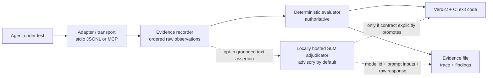

# Agent Doctor Architecture Review

Review date: 2026-07-30

This review separates what Agent Doctor demonstrates today from the controls a
production enforcement system would require. The current product is a local,
deterministic behavioral contract tester. It observes cooperative JSONL events
and harness-mediated MCP calls, evaluates them after they occur, and fails the
run when evidence violates a scenario.

It is not a sandbox or complete side-effect monitor. It now has an optional
pre-dispatch gate for configured calls routed through the harness, but it is not
a general authorization gateway for child-process activity.

## Executive assessment

The core `scenario -> execute -> evidence -> evaluate -> decision` loop is a
sound base for regression testing. Ordered evidence, strict process protocol,
stable exit codes, partial-failure reporting, report-boundary redaction, and a
real MCP stdio proxy make the MVP useful in local development and CI.

The largest architectural risk is confusing detection with prevention. The
runner can reject a run after observing a protected call, but an adapter or
child process can perform activity outside the observed protocol. Confirmation
is likewise asserted by the adapter rather than independently established by
the harness. Those boundaries are now explicit in product documentation; they
remain implementation work for any enforcement-grade mode.

## Hybrid architecture: deterministic core, local SLM edge

The non-negotiable foundation is the deterministic core. Every assertion Agent
Doctor makes today is a structural check over recorded evidence: tool presence,
tool ordering, strict precedence, run-wide and per-tool call budgets, call-counts
tied to reported outcome arrays, argument subset and JSON Schema matching,
call-scoped argument checks, argument distinctness across calls, derived-argument
references with `$fromResult`, call-scoped `$fromResult` references,
confirmation binding, outcome shape, duration, MCP latency, errors, and result
size. The checks run offline, are free per run, are reproducible in CI, and cite
the event that explains each failure. There is no model in the decision path
today. A test harness whose verdict is itself probabilistic cannot be the
regression gate.

The measured reference agent, `em-triage-steward`, now gives the roadmap a
quantitative baseline and it must be read as a paired scorecard:

| Metric | Start of cycle | End of cycle |
|---|---:|---:|
| Mutation score | 58.8% (20 killed / 34 scorable) | **96.7% (29 killed, 1 survivor)** |
| Survivors | 14 | **1** |
| False positives | 7 of 8 worlds (87.5%) | **8 of 11 worlds (72.7%)** |
| Over-blocked behaviour-preserving mutants | not measured | **1** (`reorder:5`) |

Both mutation score and false positives must always be published together. The
absolute false-positive count across the cycle went 7 -> 9 -> 8: it rose before
it fell, and 8 of 11 remains a poor false-positive result. The instrument is now
sharp at catching real defects and still too blunt at tolerating legitimate
variation.

The mutation denominator now excludes 4 invalid mutants and 4
behaviour-preserving mutants. That is not score inflation: a mutant that
produces a byte-identical outcome through an identical multiset of tool calls
should survive, and counting it as a miss would reward an over-strict contract.
The harness proves equivalence by hashing the outcome and call multiset against
a live baseline run rather than trusting a label. Removing the global `maxCalls`
ceiling, the total-order `order` list, and the `update -> escalation` precedence
rule removed over-blocking without losing a mutant kill.

The empirical SLM boundary is now exact. Once the deterministic layer can scope
an assertion to a call, to a count, and to the data, it catches every structural
defect in this workload: dropped calls, wrong ids, wrong arguments, unresolved
references, stale results, missing confirmation, and bad ordering. The single
surviving defect is `swap-arg:7:summary`, where the agent's free-text escalation
summary is replaced with different prose and no structural assertion can tell.
The residual is not large, and it is not structural. It is **natural-language
prose that must be semantically faithful to structured evidence the harness
already holds**: whether a summary's bug count matches the structured `bugIds`
array, whether a justification names the rollout ring it actually advanced, or
whether an outbound message stays within an allowed tone or policy envelope.

The designed extension is a locally hosted Small Language Model at that edge,
not a frontier-model judge in the middle of the harness. The task is closed and
heavily grounded: the model receives the structured evidence plus the text and
answers whether the text is consistent with the data. That is classification,
not open-ended reasoning, and fits a 1B-7B class model. Plausible runtimes such
as ONNX Runtime, llama.cpp, or Foundry Local and Phi-class models are
illustrative only; the interface should remain model-agnostic. Local execution
preserves the zero-egress property for production-shaped traces, and the check
runs only for assertions that opt in.

The SLM sits beside the deterministic path, not inside it. Containment rules:

- SLM assertions are opt-in per assertion, never global.
- The deterministic layer runs first and remains authoritative.
- No SLM verdict can suppress, downgrade, or waive a deterministic finding.
- SLM checks are reachable only where deterministic checks cannot express the
  assertion.
- SLM findings have their own advisory severity by default; a contract must
  explicitly promote one to blocking.
- Inputs are grounded in evidence already recorded by the harness, so the
  question is "is this text consistent with this data," not "is this good."
- The report records the model id, prompt inputs, and raw response for every SLM
  verdict, keeping the run auditable.
- Because model output is not reproducible, SLM findings are a distinct severity
  class and are excluded from mutation score and corpus false-positive rate
  unless a contract explicitly opts those metrics in.
- Fail-open versus fail-closed is a contract choice. If no model is available,
  the default result is `not_evaluated`, never a silent pass. This matches the
  existing rule that an observation the harness cannot make must be reported,
  not treated as success.

This layer is designed, not shipped. The deterministic vocabulary gaps called out
in the previous review are now largely closed: `expect.tools.arguments[].callIndex`,
`$fromResult.callIndex`, `expect.tools.budgets[]`,
`expect.tools.budgets[].callsMatchOutcome`,
`expect.tools.arguments[].distinct`, and `expect.tools.precedence` are the
constructs that completed structural recall on this workload. The remaining
deterministic gap is a relational join: expressing "this argument must equal the
result of the lookup that corresponds to this record," correlated by a shared key
rather than by call position. That join is a precision fix aimed at the 8 false
positives and the 1 over-blocked equivalent mutant, not a recall fix. The SLM
layer follows it; it should complement deterministic structure, not paper over
it.

## Findings

| Priority | Finding | Current consequence | Status |
|---|---|---|---|
| Critical | Enforcement is limited to harness-mediated dispatch. | Out-of-band child activity remains outside policy control. | Optional fail-closed gate added for fixture and MCP calls; isolation remains required. |
| Critical | Confirmation identity is adapter-attested. | The harness can bind exact arguments but cannot prove who approved them, in which tenant, or for how long. | Structural argument binding added; trusted capability issuance remains required. |
| High | Observation is cooperative and incomplete. | A child process can bypass JSONL and use files, network, subprocesses, or another client directly. | Boundary documented; isolation and instrumentation required. |
| High | Scenario commands execute as trusted local code. | An untrusted scenario can launch arbitrary adapter or MCP commands with runner privileges. | Trust warning documented; isolated execution mode required. |
| High | The MCP flow is harness-proxied. | It validates the server and requested calls but not the child agent's own native MCP client implementation. | Demo wording corrected; native-client adapter needed for that claim. |
| High | Safety contracts are opt-in. | Destructive tools or MCP annotations do not automatically require confirmation or prohibition. | Open product decision and policy-layer work. |
| Medium | Natural-language payloads can drift semantically while structural evidence still passes. | After the new deterministic constructs, the single survivor is `swap-arg:7:summary`, a free-text summary changed while the structured trace remained expressible only indirectly. | Local grounded SLM edge is designed, not shipped; relational join comes first as a precision fix. |
| Medium | Snapshot checks classify exact normalized drift only. | A change is not automatically categorized as compatible, breaking, or certified safe. | Terminology corrected; compatibility analyzer is future work. |
| Medium | Scenario semantic linting is incomplete. | Some schema-valid scenarios may still be vacuous or unable to exercise their assertions. | Core contradictions, impossible budgets, fixture reachability, fully shadowed confirmation policies, and unresolvable derived-argument references are linted; broader policy analysis remains planned. |
| Medium | Reports lack tamper-evident provenance. | Evidence does not independently prove the scenario, executable, fixtures, or report were unchanged. | Manifest and signing design planned. |
| Medium | Execution topology is narrow. | The MVP supports one child adapter, one stdio MCP server, and sequential calls. | Multi-server, parallel, streaming, and HTTP support planned. |
| Medium | Key-based redaction is not DLP. | Unknown, encoded, positional, or free-text secrets can remain in reports. | Boundary documented; minimize and sanitize test data. |

Priorities describe architecture and product risk, not disclosed security
vulnerabilities in the repository.

## Addressed in this release

- Replaced prevention language with precise detection and run-failure language.
- Labeled the safety regression as fixture-backed and stated that no external
  calendar API is called.
- Added the required JSONL adapter integration contract to the README.
- Identified confirmation as adapter-attested evidence.
- Clarified that fixture replay substitutes only mediated tool responses.
- Clarified that MCP execution uses a harness proxy rather than a native child
  MCP client.
- Documented trusted scenario commands, report redaction limits, and isolation
  guidance.
- Rebuilt marketing media from generated evidence with exact event names and
  explicit exit codes.
- Added static final frames, literal CLI inspect output, compact report-derived
  summaries, and normalized post-redaction reports beside animated demos.
- Added ordered argument/index fixture cases and semantic checks for duplicate,
  unreachable, contradictory, and impossible contracts.
- Added optional pre-dispatch enforcement with requested, authorized, denied,
  dispatched, and completed evidence.
- Added exact structural argument binding for one-use confirmation events.
- Added derived-argument binding so an argument can be asserted against a value
  observed in an earlier tool result, with unresolvable references reported
  explicitly rather than passing silently.

These changes close the harness-dispatch gap for configured fixture and MCP
calls. They do not close identity, trusted approval issuance, isolation, or
out-of-band enforcement gaps.

## Prioritized roadmap

### 1. Introduce an enforcement-capable invocation boundary

The fixture and MCP paths now evaluate configured policy before forwarding a
call and produce separate lifecycle evidence. Keep strengthening this boundary
with a negotiated denial protocol and host integrations that cannot bypass
dispatch.

Acceptance criteria:

- complete: denied fixture/MCP calls do not reach the backend;
- complete: reports distinguish requested, denied, and dispatched calls;
- complete: E2E tests prove denial has no dispatch, result, or completion;
- remaining: negotiate denial responses and integrate external connectors.

### 2. Make confirmation harness-controlled and bound

Exact argument binding is now available for one-use adapter-attested
confirmation. The remaining target is a short-lived capability issued by a
trusted host integration and bound to the authenticated principal, tenant, tool, a
canonical digest of arguments, policy version, nonce, issuance time, and
expiry. Consume it atomically at dispatch.

Acceptance criteria:

- complete: changing the tool or exact arguments invalidates structural approval;
- replay, expiry, wrong-principal, and wrong-tenant cases are rejected;
- reports identify the verifier and binding fields without persisting secrets.

### 3. Add isolation and explicit trust modes

Offer a documented isolated runner using platform primitives appropriate to the
host, with restricted network, filesystem, environment, child processes, and
resource limits. Treat Windows descendant-process cleanup as an explicit gap
until a Job Object or equivalent containment strategy is implemented.

### 4. Add scenario policy and semantic linting

Derive an inventory of mutating or destructive tools from configured policy and
MCP annotations, while requiring explicit review rather than assuming server
metadata is authoritative. Core linting now detects required/forbidden conflicts, impossible call budgets,
forbidden ordered calls, duplicate fixture selectors, unreachable fixture cases,
confirmation policies fully shadowed by forbidden-tool enforcement, and
derived-argument references that can never resolve. Continue
with mutating-tool inventory, duplicate assertions, unprotected mutations, and
fixture/result schema satisfiability.

### 5. Add provenance and reproducibility manifests

Record hashes for the scenario, fixtures, adapter command or package, MCP
snapshot, policy, Agent Doctor version, runtime, and environment metadata.
Canonicalize and sign the final manifest where organizational trust requires
it. Preserve a clear distinction between reproducible inputs and inherently
nondeterministic model execution.

### 6. Broaden adapters and topology

Add native MCP-client observation, multiple servers, parallel and streaming
calls, and an HTTP transport. Framework adapters should preserve the same
evidence vocabulary while documenting which activity each integration can and
cannot observe.

### 7. Classify MCP compatibility separately from drift

Keep exact snapshot comparison as the deterministic primitive. Add a separate,
versioned compatibility analyzer for schema and metadata changes, with reasons
and confidence grounded in protocol rules. Do not label drift checks as
certification.

### 8. Add relational joins, then optional grounded local SLM adjudication

The final contract reached 96.7% mutation score (29 killed, 1 survivor). The
corpus ended at 8 of 11 false positives (72.7%), after moving 7 -> 9 -> 8 across
the cycle. That is still too blunt for legitimate variation. The next
deterministic construct is therefore a relational join over evidence, not an
SLM: assert that an argument corresponds to the lookup result for the same record
by shared key rather than by call position. This is a precision fix aimed at the
8 false positives and the 1 over-blocked equivalent mutant (`reorder:5`), not a
recall fix. Recall is done on this workload.

After that, design the assertion shape, evidence schema, local-runtime boundary,
severity class, and replay metadata for grounded SLM checks. The first shipping
candidate should be a non-blocking, opt-in check for semantic faithfulness of
text to structured evidence, with explicit `not_evaluated` reporting when no
local model is available.

## Release bar

The MVP is suitable for deterministic regression testing when teams accept its
cooperative adapter and trusted-runner model. An enforcement-grade claim should
wait until roadmap items 1 through 3 are implemented and independently tested.
Product-market fit remains an empirical question: the relevant evidence is
whether external teams keep useful scenarios in pull requests with acceptable
maintenance cost and false-failure rates.